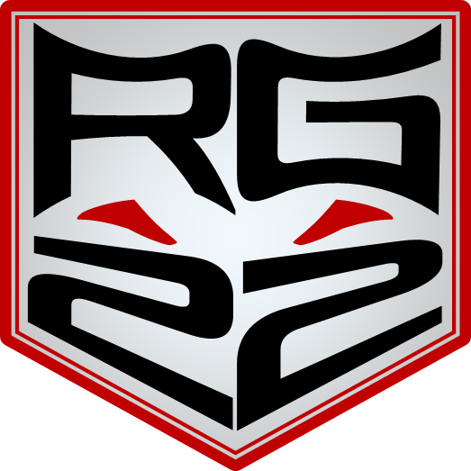
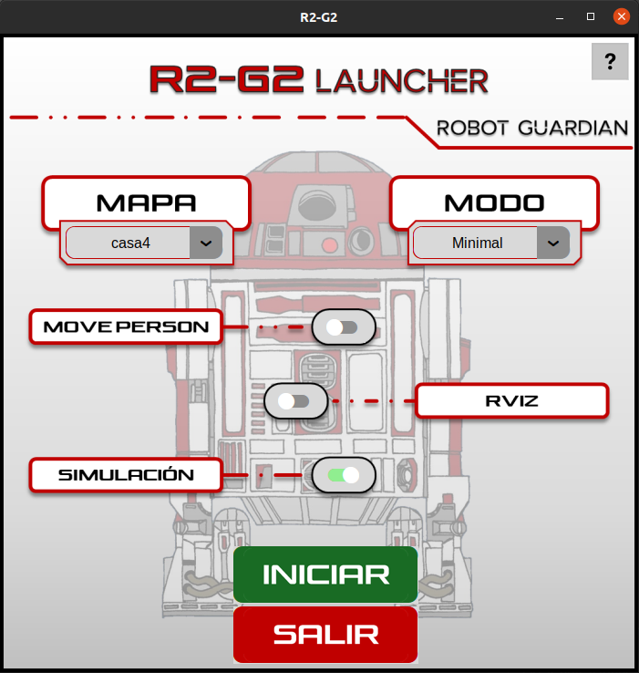
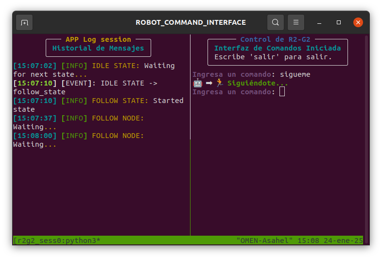
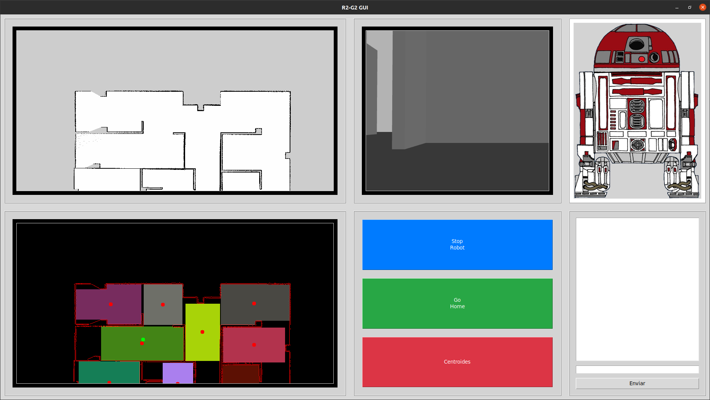

<!-- Improved compatibility of back to top link: See: https://github.com/othneildrew/Best-README-Template/pull/73 -->
<a id="readme-top"></a>
<!--
*** Thanks for checking out the Best-README-Template. If you have a suggestion
*** that would make this better, please fork the repo and create a pull request
*** or simply open an issue with the tag "enhancement".
*** Don't forget to give the project a star!
*** Thanks again! Now go create something AMAZING! :D
-->


<!-- Improved compatibility of back to top link: See: https://github.com/othneildrew/Best-README-Template/pull/73 -->
<a id="readme-top"></a>
<!--
*** Thanks for checking out the Best-README-Template. If you have a suggestion
*** that would make this better, please fork the repo and create a pull request
*** or simply open an issue with the tag "enhancement".
*** Don't forget to give the project a star!
*** Thanks again! Now go create something AMAZING! :D
-->


<!-- PROJECT SHIELDS -->
<!--
*** I'm using markdown "reference style" links for readability.
*** Reference links are enclosed in brackets [ ] instead of parentheses ( ).
*** See the bottom of this document for the declaration of the reference variables
*** for contributors-url, forks-url, etc. This is an optional, concise syntax you may use.
*** https://www.markdownguide.org/basic-syntax/#reference-style-links
-->


<!-- GETTING STARTED -->
<div align="center">

</div>

## Introducción

Este repositorio contiene el paquete de ROS security_robot para la asignatura Robots Móviles. 

Security_robot implementa el proyecto R2-G2, un robot guardián inspirado en el mítico R2-D2 y que contiene las siguientes funcionalidades:

- [X] Navegación autónoma 
- [X] Exploración y mapeado autónomo 
- [X] Procesado del mapa y segmentación por áreas y 
- [X] Guardar un perimetro entorno a un punto (patrulla áreas)
- [X] Patrulla por ruta predefinida 
- [X] Reconocimiento y seguimiento de personas
- [X] Búsqueda de QRs y navegación hasta QRs guardados
- [X] Interfaz gráfica, interacción por voz y control por gestos

### Prerequisitos

Estos son los siguientes requisitos que se necesitan para poder usar el paquete:
1. ROS Noetic para Ubuntu: [http://wiki.ros.org/noetic/Installation/Ubuntu](http://wiki.ros.org/noetic/Installation/Ubuntu)
2. Turtlebot2: 
Instalar el simulador de Turtlebot 2

* Instrucciones
  ```sh
  #Dependencias de paquetes de Ubuntu
  sudo apt install libusb-dev libftdi-dev python-is-python3 pyqt5-dev-tools

  #Dependencias de paquetes de Noetic
  sudo apt install ros-noetic-openslam-gmapping ros-noetic-joy ros-noetic-base-local-planner ros-noetic-move-base

  #Directorio para los fuentes
  mkdir $HOME/tb2_ws
  cd $HOME/tb2_ws

  #Se baja los fuentes de los repos especificados en el .rosinstall
  wstool init src ../tb2.rosinstall

  #Arregla un problema de dependencias
  rm -rf src/ar_track_alvar/ar_track_alvar

  #Compilar.
  catkin_make_isolated
  ```

3. Workspace de catkin previamente creado: [http://wiki.ros.org/catkin/Tutorials/create_a_workspace](http://wiki.ros.org/catkin/Tutorials/create_a_workspace)
4. Gazebo: [https://classic.gazebosim.org/tutorials?tut=install_ubuntu](https://classic.gazebosim.org/tutorials?tut=install_ubuntu) 
5. Mediapipe: [https://pypi.org/project/mediapipe/](https://pypi.org/project/mediapipe/)
6. Paquete de ROS explore_lite: [http://wiki.ros.org/explore_lite](http://wiki.ros.org/explore_lite) 
   
### Instalación

Para instalar el paquete security_robot:

1. Clonar el repositorio dentro de la carpeta src del WS de catkin:
   ```sh
   git clone https://github.com/Hispano1919/security_robot.git
   ```
2. Cambiar el nombre del directorio descargado a security_robot (sólo si tiene otro nombre, como por ejemplo: security_robot-master)

3. Dependencias de Python:
   ```sh
   pip install -r requirements.txt
   ```

4. Desde el directorio raiz del WS de catkin:
   ```sh
   # Compila el paquete de ROS
   catkin build security_robot

   # Actualiza el entorno
   source devel/setup.bash
   ```

Con estos pasos el paquete ya debería estar correctamente compilado y listo para su uso.
<p align="right">(<a href="#readme-top">back to top</a>)</p>


<!-- USAGE EXAMPLES -->
## Uso

### Lanzamiento
Para usar este paquete se ha implementado una interfaz visual que permite lanzar la aplicación de manera cómoda y sencilla en simulación:
Desde una terminal situada en la carpeta src del paquete:
```sh
      python UI_launcher.py
   ```

Esto abrirá una interfaz gráfica con todas las opciones disponibles de la aplicación
<div align="center">

</div>

+ Mapa:
   Permite escoger el mapa que se desea utilizar en la aplicación. Se leen cargan automáticamente los mapas situados en la carpeta worlds del paquete.

+ Modo:
   
   1. Minimal:
      - Se lanzan los nodos:
         - Interfaz por línea de comandos
         - Nodo principal (APP_main)

   2. Light:

      - Se lanzan los nodos:
         - Deteccion de personas
         - Control de voz
         - Interfaz visual
         - Nodo principal (APP_main)

   3. Heavy:
      - Se lanzan todos los nodos:
         - Deteccion de personas
         - Control de voz
         - Control por gestos
         - Interfaz visual
         - Interfaz por línea de comandos
         - Nodo principal (APP_main)

   4. Explore:
      Se lanza un módulo independiente para explorar y mapear automáticamente el entorno.
   
   5. Segmentation:
      Se lanza un módulo independiente para segmentar por áreas el mapa seleccionado.

+ MovePerson:
Activando move_person se lanzará el nodo de movimiento de persona en un entorno simulado de gazebo.
         
+ RVIZ: 
Activando rviz lanzará el entorno de visualización rviz.

+ Simulación:
Por defecto activado, lanza la simulación en Gazebo. Se debe desactivar para utilizar el paquete sobre el Turtlebot real.

### Interfaz por línea de comandos e interfaz de voz

Ambas interfaces cumplen el mismo objetivo, permitir una interacción fluida con el robot, de manera que mediante comandos de lenguaje natural
el robot es capaz de interpretar las órdenes y actuar en consecuencia. 

Para utilizar le control por voz, una vez el robot ha indicado que está a la escucha ("Hola, te escucho"), mediante frases cortas se puede ordenar al robot (siempre deben ir precedidas de la palabra robot). Ejemplos:

 1. robot, sígueme (el robot comenzará a seguir a la persona cuando la detecte) 
 2. robot, patrulla 
 3. robot, ve a la cocina 

De igual manera, la interfaz por línea de comandos acepta las mismas órdenes, sin necesidad de incluir la palabra robot. 

<div align="center">

</div>

### Interfaz visual

<div align="center">

</div>

La interfaz visual está compuesta por diferentes áreas:

1. Botones: Los botones permiten una interacción rápida con el robot.
2. Mapa segmentado: Al hacer click sobre el mapa segmentado por áreas, el robot realizará una patrullaje perimetral sobre el área seleccionada.
3. Mapa en escala de grises: Mediante dos clicks (primero indica posición, segundo indica orientación), el robot se desplazará hacia el punto seleccionado.
4. 

## Workspace

El workspace del paquete está distribuido de la siguiente manera:
```plaintext
📂 security_robot
├── 🔧 CMakeLists.txt
├── 📂 config
│   ├── ⚙️ costmap_common_params.yaml
│   ├── ⚙️ costmap_common.yaml
│   ├── ⚙️ costmap_global.yaml
│   ├── ⚙️ costmap_local.yaml
│   ├── ⚙️ exploration.yaml
│   ├── ⚙️ move_base.yaml
│   ├── ⚙️ navfn_global_planner_params.yaml
│   ├── ⚙️ planner_global.yaml
│   └── ⚙️ planner_local.yaml
├── 📂 images
│   └── ...
├── 📂 launch
│   ├── 📁 includes
│   ├── 🌐 exploration.launch
│   ├── 🌐 navigation.launch
│   ├── 🌐 nodes_heavy.launch
│   ├── 🌐 nodes_light.launch
│   ├── 🌐 nodes_minimal.launch
│   ├── 🌐 person_world.launch
│   └── 🌐 world.launch
├── 📂 nav_maps
│   └── ...
├── 📂 obj_models
│   ├── 📁 person_walking
│   │   ├── ...
│   │   ...
│   ├── 📁 qr_cocina
│   │   ├── ...
│   │   ...
│   ├── 📁 qr_habitacion
│   │   ├── ...
│   │   ...
│   ├── 📁 qr_salon
│   │   ├── ...
│   │   ...
│   └── 📁 qr_wc
│       ├── ...
│       ...
├── 📂 output_files
│   ├── 📂 restricted_maps
│   ...
├── 📜 package.xml
├── 📜 README.md
├── 🔧 requirements.txt
├── 📂 src
│   ├── 🛠️ APP_config.py
│   ├── 🚀 APP_main.py
│   ├── 🛠️ APP_map_name_updater.py
│   ├── 🛠️ APP_map_processor.py
│   ├── 🤖 APP_move_person.py
│   ├── 🤖 MR_follow_person.py
│   ├── 🤖 MR_move_to_point.py
│   ├── 🤖 MR_move_to_qrWaypoint.py
│   ├── 🤖 MR_patrol_area.py
│   ├── 🤖 MR_patrol_route.py
│   ├── 🛠️ run.sh
│   ├── 🔍 RV_pDetector_mediapipe.py
│   ├── 🔍 RV_pDetector_mediapipeGPU.py
│   ├── 🔍 RV_pDetector_MoveNet.py
│   ├── 🔍 RV_QR_finder.py
│   ├── 🛠️ UI_bash_interface.py
│   ├── 🛠️ UI_gui_interface.py
│   ├── 🛠️ UI_hand_control.py
│   ├── 🛠️ UI_launcher.py
│   └── 🗣️ UI_voice_control.py
├── 📂 trained_models
│   ├── 🤖 lite-model_movenet_singlepose_lightning_3.tflite
│   ├── 🤖 pose_landmarker_full.task
│   ├── 🤖 pose_landmarker_heavy.task
│   ├── 🤖 pose_landmarker_lite.task
│   └── 📁 vosk-model-small-es-0.42
│       ├── ...
│       ...
└── 📂 worlds
    ├── 🌐 casa1.world
    ├── 🌐 casa2.world
    ├── 🌐 casa3.world
    ├── 🌐 casa4.world
    ├── 🌐 casa_grande.world
    ├── 🌐 random.world
    └── 🌐 security_world.world

```
1. La carpeta /config contiene las configuraciones necesarias para lanzar la exploración mediante el paquete explore_lite.

2. La carpeta /images contiene las imágenes usadas por las interfaces gráficas.

3. En la carpeta /launch se encuentran todos los ficheros .launch implementados. Estos .launch son lanzados de manera automática por el fichero run.sh pero pueden ser lanzados independientemente mediante el paquete de ROS, roslaunch:
```sh
   roslaunch security_robot <launch file>
```

4. La carpeta /nav_maps contiene los mapas usados por el stack de navegación. Aquí deben situarse los mapas construidos.

5. /obj_models contiene los modelos de Gazebo usados en el mampa por defecto.

6. /output_files contiene todos los ficheros procedentes de la ejecución de la aplicación. Tanto para la segmentación de los mapas como para el guardado de los waypoints detectados con QRs.

7. La carpeta /src contiene los códigos fuente que lanzan los distintos nodos y funcionalidades.

8. En /trained_models se incluyen los modelos y dependencias necesarias para poder usar el reconocmiento de voz y diferentes métodos de detección de personas (no necesarios si se está usando Mediapipe por defecto)

9. En /worlds contiene los ficheros .world que utiliza Gazebo para la simulación. Por defecto se lanza la simulación casa3.world.


<p align="right">(<a href="#readme-top">back to top</a>)</p>


<!-- ACKNOWLEDGMENTS -->
## Participantes

- José Llorens Megías
- Asahel Hernández Torné

<p align="right">(<a href="#readme-top">back to top</a>)</p>

